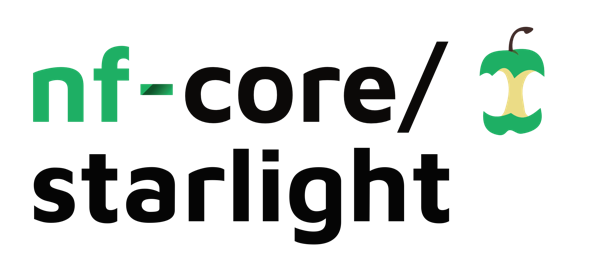

<h1>
  <picture>
    <source media="(prefers-color-scheme: dark)" srcset="docs/images/nf-core-starlight_logo_dark.png">
    
  </picture>
</h1>

[](https://www.nextflow.io/)
[](https://github.com/nf-core/tools/releases/tag/3.5.2)
[](https://sylabs.io/docs/)

## Introduction

**panoramaseq_nano** (nf-core/starlight) is a Nextflow pipeline for **Oxford Nanopore spatial / single-cell long-read cDNA** sequencing. It extracts spatial barcodes and UMIs from raw reads, corrects barcodes with QUIK, aligns cDNA to a reference genome, and quantifies expression using one of three modes:

| Mode | `--gene_quant_mode` | Approach |
|------|---------------------|----------|
| **epi2me** | `epi2me` | StringTie assembly → transcriptome align → wf-single-cell gene assignment → 10x MEX |
| **isoquant** | `isoquant` | UMI-tools dedup → IsoQuant on genome BAM (per-cell barcode groups) |
| **oarfish** | `oarfish` | R2 FASTQ → reference transcriptome align → UMI dedup → Oarfish 0.9.4 → 10x MEX |

See [docs/architecture.md](docs/architecture.md) for the full workflow diagram and parameter reference.


1. Read QC ([FastQC](https://www.bioinformatics.babraham.ac.uk/projects/fastqc/))
2. Optional quality trimming ([Chopper](https://github.com/wdecoster/chopper))
3. Read orientation ([Restrander](https://github.com/jakob-schuster/restrander))
4. Spatial barcode / UMI extraction and QUIK correction
5. Genome alignment ([minimap2](https://github.com/lh3/minimap2)) and BAM tagging
6. Gene quantification (epi2me, IsoQuant, or Oarfish — one per run)
7. Aggregate QC ([MultiQC](http://multiqc.info))

## Usage

```bash
nextflow run https://github.com/OncoRNALab/panoramaseq_nano \
  -profile singularity,gpu \
  --input samplesheet.csv \
  --outdir results/ \
  --restrander_config assets/restrander/PCB109.json \
  --barcode_whitelist barcodes.csv \
  --genome_fasta genome.fa \
  --genome_gtf annotation.gtf \
  --gene_quant_mode epi2me
```

See [docs/usage.md](docs/usage.md) for samplesheet format, examples per quant mode, and barcode extraction parameters.

> [!WARNING]
> Provide pipeline parameters via the CLI or `-params-file`. Do not pass parameters through `-c` custom config files.

## Documentation

| Document | Description |
|----------|-------------|
| [docs/usage.md](docs/usage.md) | Running the pipeline |
| [docs/architecture.md](docs/architecture.md) | Workflow architecture |
| [docs/output.md](docs/output.md) | Output files |
| [docs/comparison.md](docs/comparison.md) | Comparing epi2me / isoquant / oarfish |

## Credits

panoramaseq_nano was originally written by Poma-Soto Franco, Croughs Quinn.

## Citations

Tool references: [`CITATIONS.md`](CITATIONS.md)
