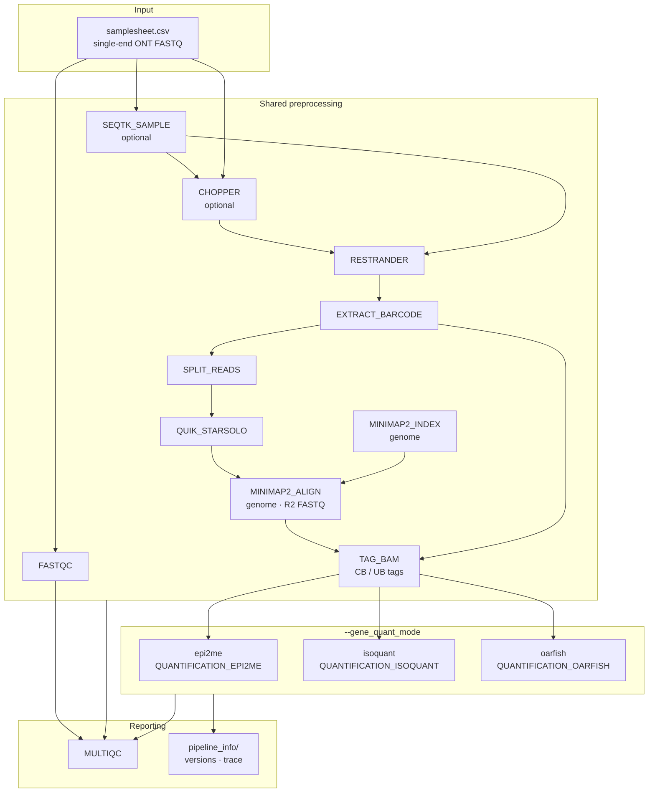
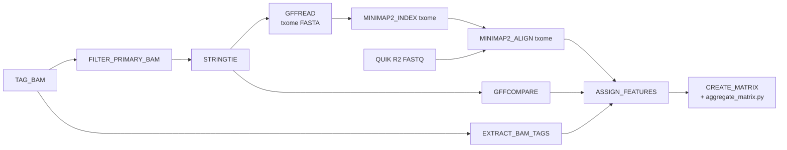
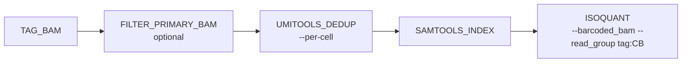
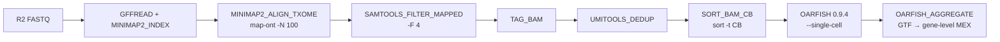

# panoramaseq-nano — Pipeline architecture

*Last updated: 2026-06-28*

a Nextflow pipeline for **Oxford Nanopore (ONT) spatial / single-cell long-read cDNA** data. It extracts spatial barcodes and UMIs from raw reads, corrects barcodes with QUIK, aligns cDNA to a reference genome, tags BAM records with cell and UMI metadata, and quantifies gene expression using one of three downstream modes selected by `--gene_quant_mode`.

Entry point: `workflows/starlight.nf`

---

## High-level architecture



Only **one** quantification branch runs per pipeline execution.

---

## Shared preprocessing (all modes)

Raw reads pass through a fixed front-end before genome alignment. This block is independent of `--gene_quant_mode`.

```
RAW FASTQ (.fastq.gz, single-end)
    │
    ├─ FASTQC                         QC on raw (or subsampled) reads
    │
    ├─ [optional] SEQTK_SAMPLE        subsample to --n_reads
    │
    ├─ [optional] CHOPPER             quality trim/filter (--chopper_enabled true)
    │
    ▼
RESTRANDER                          orient reads (mandatory; JSON config)
    │  → {sample}.restranded.fastq.gz, stats.json
    ▼
EXTRACT_BARCODE                     parasail SW: spatial BC + structured UMI
    │  → bc_tags.tsv.gz  (read_id, cdna_start, barcode_start, CR, CY, UR, UY, …)
    ▼
SPLIT_READS                         split each read using bc_tags coordinates
    │  → R1 = barcode segment (36 bp)
    │  → R2 = cDNA segment (UR/UY embedded in FASTQ header comment)
    ▼
QUIK_STARSOLO                       GPU barcode correction + whitelist filter
    │  → R1_filtered, R2_filtered (synchronized)
    ▼
MINIMAP2_INDEX                      build genome .mmi (skipped if --genome_mmi set)
    ▼
MINIMAP2_ALIGN                      -ax splice -uf --MD -y  (R2 FASTQ → genome BAM)
    ▼
TAG_BAM                             merge QUIK barcodes + bc_tags → BAM tags
    │  → {sample}.tagged.bam + .bai
    │     tags: CB, CR, CY, UB, UR, UY
    │
    └─► branch on --gene_quant_mode
```

### Design notes

| Step | Input type | Why it matters |
|------|------------|----------------|
| Genome minimap2 | **R2 FASTQ** | Standard nf-core path; UMI carried via `-y` from FASTQ header |
| TAG_BAM | Genome BAM + bc_tags | Adds `CB`/`UB` tags required by all quantification modes |
| QUIK R2 channel | Kept for **epi2me** txome align | epi2me realigns cDNA FASTQ, not BAM |

Requires `--genome_fasta` (or `--genome_mmi`) and `--genome_gtf` for any quantification branch to run.

---

## Quantification branches

### Mode comparison

| | **epi2me** | **isoquant** | **oarfish** |
|---|------------|--------------|-------------|
| Param | `gene_quant_mode = 'epi2me'` | `'isoquant'` | `'oarfish'` |
| Also requires | `stringtie_enabled = true` | — | — |
| Alignment target | Sample transcriptome (StringTie) | Genome (native) | Reference or StringTie transcriptome |
| UMI handling | workflow-glue clustering in create_matrix | UMI-tools dedup → IsoQuant | UMI-tools dedup → Oarfish |
| Primary output | 10x MEX (gene + transcript) | IsoQuant grouped MTX (gene + transcript) | 10x MEX (transcript + gene aggregated) |
| Isoform discovery | StringTie assembly | IsoQuant `sensitive_ont` model construction | Optional StringTie txome |

### Default sensitivity (relaxed / permissive defaults)

The **isoquant** and **oarfish** default parameters are tuned for **sensitivity and capture**
rather than strict filtering. This suits exploratory single-cell or single-nuclei long-read
analysis where the goal is to detect as many transcripts and isoforms as possible. For
publication-grade conservative counts, tighten settings explicitly (see notes below).

#### Oarfish — relaxed (default)

Default: `--single-cell --model-coverage --filter-group no-filters`

| Flag | Role |
|------|------|
| `--filter-group no-filters` | **Key relaxed setting.** Disables NanoCount-style alignment pre-filters (3'/5' clip limits, secondary score cutoffs, min aligned fraction, etc.), so more alignments enter quantification. Multimapping reads are not discarded; they are allocated probabilistically across candidate transcripts via EM. |
| `--model-coverage` | Uses read coverage in the probabilistic model when splitting counts across isoforms. |

Upstream, transcriptome realignment uses `minimap2 -N 100` to retain secondary alignments
for the EM step. **Overall: very permissive**, designed to capture as much signal as possible.

For stricter alignment filtering, use `--oarfish_args '--filter-group nanocount-filters'` (or
append other Oarfish filter flags).

#### IsoQuant — moderately relaxed (default)

Core defaults in `conf/modules.config`: `--model_construction_strategy sensitive_ont`,
`--splice_correction_strategy default_ont`, plus conditional quantification modes.

| Component | Default behaviour |
|-----------|-------------------|
| `sensitive_ont` | More permissive ONT model construction; detects more transcript models than conservative strategies. |
| `default_ont` splice correction | Standard ONT splice-correction approach. |
| `retain_introns=false` (default) | `--gene_quantification unique_inconsistent` (genes: unique + inconsistent assignments) and `--transcript_quantification unique_only` (transcripts: **stricter** — ambiguous/multimapping reads excluded from transcript counts). |
| `retain_introns=true` | `--gene_quantification all` and `--transcript_quantification all` — **very relaxed** (keeps all assignment categories, including ambiguous and intronic). |

**Overall: moderately relaxed.** `sensitive_ont` and gene-level `unique_inconsistent` favour
sensitivity, but transcript-level `unique_only` (the default when `retain_introns=false`) still
filters out ambiguous and multimapping reads at isoform resolution. Set `--retain_introns true`
for maximum permissiveness, or pass stricter flags via `--isoquant_args` (e.g.
`--no_model_construction` for faster quantification-only runs against fixed annotation).

#### Summary

| Method | Default posture | Main permissive lever |
|--------|-----------------|------------------------|
| **Oarfish** | Relaxed | `--filter-group no-filters` + EM multimapping |
| **IsoQuant** | Moderately relaxed | `sensitive_ont`; full permissiveness only with `--retain_introns true` |

These defaults align with published ONT scRNA pipelines (e.g. nf-core/scnanoseq-style
configurations). Cross-method count totals are **not directly comparable** without accounting
for these differences (see comparison caveats in project comparison summaries).

---

### epi2me (`QUANTIFICATION_EPI2ME`)

Adapted from Oxford Nanopore **wf-single-cell** (`bin/workflow_glue/`).



```
TAG_BAM + QUIK R2
    → FILTER_PRIMARY_BAM
    → STRINGTIE (per-sample transcriptome)
    → GFFREAD → transcriptome FASTA
    → MINIMAP2 txome align (R2 FASTQ, -ax map-ont -y)
    → GFFCOMPARE (StringTie vs reference GTF → .tmap)
    → EXTRACT_BAM_TAGS (from genome tagged BAM)
    → ASSIGN_FEATURES (workflow-glue)
    → CREATE_MATRIX (UMI clustering → HDF chunks → 10x MEX)
```

Subworkflow: `subworkflows/local/quantification_epi2me.nf`

---

### isoquant (`QUANTIFICATION_ISOQUANT`)

Classical long-read quantification on **genome-aligned, UMI-dedup BAM** with per-cell read groups.



```
TAG_BAM
    → [optional] FILTER_PRIMARY_BAM  (--isoquant_use_primary)
    → UMITOOLS_DEDUP  (--per-cell, directional)
    → samtools index
    → ISOQUANT  (genome BAM + GTF + FASTA; CB tag as read group)
```

Subworkflow: `subworkflows/local/quantification_isoquant.nf`

Default IsoQuant flags (set in `conf/modules.config`, overridable via `--isoquant_args`):

| Flag | Default (`retain_introns=false`) |
|------|----------------------------------|
| `--complete_genedb` | on |
| `--model_construction_strategy` | `sensitive_ont` |
| `--splice_correction_strategy` | `default_ont` |
| `--gene_quantification` | `unique_inconsistent` |
| `--transcript_quantification` | `unique_only` |
| `--counts_format` | `mtx` |
| `--stranded` | from `strandedness` (`none` / `forward` / `reverse`) |

Set `--retain_introns true` to use `--gene_quantification all --transcript_quantification all`.

See [Default sensitivity (relaxed / permissive defaults)](#default-sensitivity-relaxed--permissive-defaults)
above for interpretation of these defaults. See `docs/isoquant_implementation_plan.md` for
alternative run modes and performance notes.

---

### oarfish (`QUANTIFICATION_OARFISH`)

Transcriptome-based single-cell quantification with **Oarfish 0.9.4** (scnanoseq-style FASTQ path; no genome alignment).



```
QUIK R2 (cDNA FASTQ)
    → gffread(reference GTF) → MINIMAP2_INDEX txome
    → MINIMAP2_ALIGN_TXOME  (map-ont, -N 100)
    → SAMTOOLS_FILTER_MAPPED  (-F 4, mapped only)
    → TAG_BAM  (CB, UB)
    → UMITOOLS_DEDUP
    → SORT_BAM_CB  (samtools sort -t CB)
    → OARFISH  (--single-cell --filter-group no-filters --model-coverage)
    → OARFISH_AGGREGATE  (transcript MEX + gene-level sum via reference GTF)
```

Subworkflow: `subworkflows/local/quantification_oarfish.nf`

Oarfish outputs plain transcript IDs (one per line). Gene aggregation maps `transcript_id → gene_id` from the reference GTF in `bin/oarfish_aggregate_genes.py`.

See [Default sensitivity (relaxed / permissive defaults)](#default-sensitivity-relaxed--permissive-defaults)
above. See `docs/oarfish_implementation_plan.md` for container pins and validation notes.

---

## Key parameters

### Preprocessing

| Parameter | Default | Purpose |
|-----------|---------|---------|
| `chopper_enabled` | `false` | Run Chopper before Restrander |
| `restrander_config` | `assets/restrander/PCB109.json` | Restrander orientation config |
| `barcode_whitelist` | — | QUIK whitelist (RC of RT-primer barcodes) |
| `barcode_length` | `36` | Spatial barcode length |
| `n_reads` | null | Optional subsampling |

### Reference

| Parameter | Default | Purpose |
|-----------|---------|---------|
| `genome_fasta` | null | Reference genome FASTA |
| `genome_mmi` | null | Prebuilt minimap2 index |
| `genome_gtf` | null | Gene annotation GTF |

### Quantification mode

| Parameter | Default | Purpose |
|-----------|---------|---------|
| `gene_quant_mode` | `epi2me` | `epi2me` \| `isoquant` \| `oarfish` |
| `stringtie_enabled` | `true` | Required for epi2me branch |
| `retain_introns` | `false` | IsoQuant intronic read retention (`all` vs `unique_*` quant modes) |
| `isoquant_args` | `''` | Additional IsoQuant CLI flags (appended after pipeline defaults) |
| `isoquant_use_primary` | `true` | Primary-only filter before dedup |
| `oarfish_args` | `--single-cell --model-coverage --filter-group no-filters` | Oarfish CLI |
| `oarfish_save_transcript_secondary_alignment` | `true` | `-N 100` on txome FASTQ align |
| `umitools_dedup_method` | `directional` | Shared by isoquant and oarfish |

Full parameter list: `nextflow_schema.json` (also rendered on the nf-core website).

---

## Output layout

All paths relative to `--outdir`. Quantification outputs live under **`{outdir}/{gene_quant_mode}/`** so epi2me, isoquant, and oarfish can share one outdir when comparing modes with `-resume`.

```
{outdir}/
├── fastqc/                         # shared preprocessing
├── restrander/{sample}/
├── quik_starsolo/{sample}/
├── minimap2/{sample}/
├── tag_bam/{sample}/
├── pipeline_info/                  # shared (params.json = latest run)
├── epi2me/                         # gene_quant_mode = epi2me
├── isoquant/                       # gene_quant_mode = isoquant
└── oarfish/                        # gene_quant_mode = oarfish
```

### Shared (every run)

| Directory | Contents |
|-----------|----------|
| `fastqc/` | Raw-read FastQC reports |
| `chopper/{sample}/` | Trimmed FASTQ (if Chopper enabled) |
| `restrander/{sample}/` | Oriented FASTQ + stats JSON |
| `extract_barcode/{sample}/` | bc_tags.tsv.gz |
| `quik_starsolo/{sample}/` | QUIK-filtered R1/R2 |
| `minimap2/{sample}/` | Genome-aligned BAM |
| `tag_bam/{sample}/` | Tagged genome BAM + index |
| `pipeline_info/` | Nextflow reports, params.json, software versions |

### epi2me (`{outdir}/epi2me/`)

| Directory | Contents |
|-----------|----------|
| `filter_primary_bam/{sample}/` | Primary-filtered genome BAM |
| `stringtie/{sample}/` | Per-sample GTF + abundances |
| `transcriptome/{sample}/` | Transcriptome FASTA |
| `minimap2_transcriptome/{sample}/` | Txome-aligned BAM |
| `gffcompare/{sample}/` | .tmap mapping file |
| `assign_features/{sample}/` | feature_assigns.tsv.zst |
| `create_matrix/{sample}/` | 10x MEX gene + transcript matrices |
| `multiqc/` | QC report for this run |

### isoquant (`{outdir}/isoquant/`)

| Directory | Contents |
|-----------|----------|
| `filter_primary_bam/{sample}/` | Primary-filtered genome BAM |
| `umitools_dedup/{sample}/` | Dedup BAM + log |
| `{sample}/` | IsoQuant tables + isoquant.log |
| `multiqc/` | QC report for this run |

### oarfish (`{outdir}/oarfish/`)

| Directory | Contents |
|-----------|----------|
| `filter_primary_bam/{sample}/` | Primary-filtered genome BAM |
| `umitools_dedup/{sample}/` | Dedup BAM + log |
| `transcriptome/reference/` | Reference txome FASTA (default) |
| `{sample}/transcriptome_align/` | Txome-realigned BAM |
| `{sample}/cb_sorted/` | CB-collated BAM |
| `{sample}/quant/` | Raw Oarfish MEX |
| `{sample}/` | Gene + transcript 10x MEX, aggregation stats |
| `multiqc/` | QC report for this run |

See [output.md](docs/output.md) for file-level detail.

---

## Module inventory

### Custom scripts (`bin/`)

| Script | Used by |
|--------|---------|
| `extract_barcode.py` | EXTRACT_BARCODE |
| `split_reads.py` | SPLIT_READS |
| `tag_bam.py` | TAG_BAM |
| `extract_bam_tags.py` | EXTRACT_BAM_TAGS |
| `aggregate_matrix.py` | CREATE_MATRIX |
| `oarfish_aggregate_genes.py` | OARFISH_AGGREGATE |
| `workflow-glue` | ASSIGN_FEATURES, CREATE_MATRIX |

### Local Nextflow modules (`modules/local/`)

| Module | Role |
|--------|------|
| `restrander` | Read orientation |
| `extract_barcode`, `split_reads` | BC/UMI extraction and read splitting |
| `quik_starsolo` | GPU barcode correction |
| `tag_bam` | BAM tagging |
| `filter_primary_bam` | Primary alignment filter |
| `sort_bam_names` | Name-sorted BAM (epi2me) |
| `sort_bam_cb` | CB-collated BAM (oarfish) |
| `minimap2_align_txome` | R2 FASTQ → transcriptome align (oarfish) |
| `samtools_filter_mapped` | Mapped-only BAM filter (oarfish) |
| `samtools_faidx`, `samtools_index` | Index helpers |
| `assign_features`, `create_matrix` | epi2me quantification |
| `isoquant` | IsoQuant wrapper |
| `oarfish`, `oarfish_aggregate` | Oarfish quantification + gene aggregation |

### nf-core modules

`fastqc`, `chopper`, `seqtk/sample`, `minimap2/index`, `minimap2/align`, `stringtie/stringtie`, `gffread`, `gffcompare`, `umitools/dedup`, `multiqc`

---

## Further reading

| Document | Contents |
|----------|----------|
| [pipeline_overview.md](docs/pipeline_overview.md) | Colleague-facing step-by-step summary (incl. workflow-glue) |
| [first_implementations.md](docs/first_implementations.md) | Implementation status, bug-fix log, open questions |
| [isoquant_implementation_plan.md](docs/isoquant_implementation_plan.md) | IsoQuant modes, performance, output handling |
| [oarfish_implementation_plan.md](docs/oarfish_implementation_plan.md) | Oarfish requirements, containers, validation |
| [quik_implementations.md](docs/quik_implementations.md) | QUIK / barcode correction details |
| [output.md](docs/output.md) | Published output file reference |
| [usage.md](docs/usage.md) | Running the pipeline |

Workflow entry: `workflows/starlight.nf` · Publish paths: `conf/modules.config`
