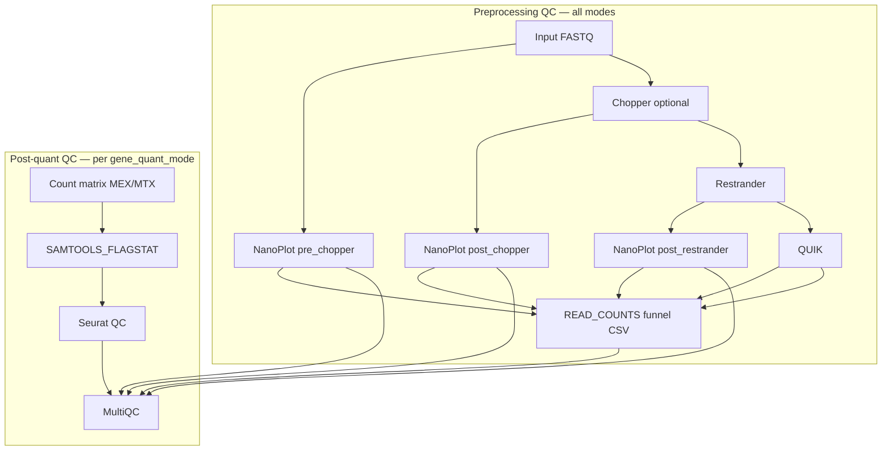

# Implementation Plan — QC modules (read-count funnel, NanoPlot, Seurat)

*Status: planned — not yet implemented.*

---

## Goal

Add three QC features inspired by [nf-core/scnanoseq](https://github.com/nf-core/scnanoseq), aligned with **scnanoseq defaults** (only tools that run when `skip_qc=false` and are **not** disabled by default).

| Priority | Feature | scnanoseq default | STARLIGHT today |
|----------|---------|-------------------|-----------------|
| 1 | **Read-count funnel** | On (`READ_COUNTS`) | Not implemented |
| 2 | **NanoPlot** | On (`skip_nanoplot=false`) | Not implemented |
| 3 | **Seurat post-quant QC** | On (`skip_seurat=false`) | Not implemented |

---

## Explicitly out of scope (skipped by default in scnanoseq)

Do **not** implement in this work:

| Tool | scnanoseq param | Default |
|------|-----------------|---------|
| ToulligQC | `skip_toulligqc` | `true` (off) |
| Extra FastQC stages (post-trim / post-extract) | `skip_fastqc` | `true` (off) |
| NanoComp (FASTQ) | `skip_fastq_nanocomp` | `true` (off) |
| NanoComp (BAM) | `skip_bam_nanocomp` | `true` (off) |

Also **not** in this plan (not requested; separate future work):

- RSeQC read distribution (`skip_rseqc=false` in scnanoseq, but not a priority here)
- Full `BAM_STATS_SAMTOOLS` (stats + idxstats + flagstat everywhere)
- Second MultiQC report (“raw QC” vs “final QC”) — extend the **existing** STARLIGHT MultiQC instead

STARLIGHT keeps its **existing single FastQC** on raw input; no additional FastQC stages.

---

## Minimal dependency: `SAMTOOLS_FLAGSTAT` for Seurat only

scnanoseq’s `seurat_qc.R` **requires** a samtools flagstat file (parses total read count for summary stats). This is not a separate scnanoseq “QC module” users toggle off — it is a **Seurat input dependency**.

**Plan:** add `SAMTOOLS_FLAGSTAT` (nf-core module) only on the BAM that best represents reads entering quantification:

| Mode | Flagstat BAM |
|------|--------------|
| **epi2me** | Primary-filtered genome BAM (same as StringTie input) |
| **isoquant** | UMI-dedup genome BAM |
| **oarfish** | UMI-dedup transcriptome BAM (post-`UMITOOLS_DEDUP`, pre-Oarfish) |

Do **not** add idxstats/stats/RSeQC/NanoComp BAM.

---

## Architecture overview



---

## Part 1 — NanoPlot (preprocessing)

### scnanoseq behaviour (defaults)

- Runs at **pre-trim**, **post-trim**, **post-extract** via `QCFASTQ_NANOPLOT_FASTQC`
- With scnanoseq defaults (`skip_fastqc=true`, `skip_nanoplot=false`), only **NanoPlot** runs at each stage

### STARLIGHT stage mapping

Map scnanoseq’s three checkpoints to STARLIGHT preprocessing:

| Stage | scnanoseq | STARLIGHT channel | NanoPlot prefix |
|-------|-----------|-------------------|-----------------|
| 1 — pre-trim | Raw FASTQ | `ch_reads` (after optional `SEQTK_SAMPLE`) | `{sample}.pre_chopper` |
| 2 — post-trim | Post-Chopper | `CHOPPER.out.fastq` or `ch_reads` if chopper off | `{sample}.post_chopper` |
| 3 — post-extract | Post barcode extract | `RESTRANDER.out.reads` | `{sample}.post_restrander` |

**Chopper disabled:** skip NanoPlot stage 2 *or* run on the same FASTQ as stage 1 and document in funnel that trimmed = input counts (prefer **skip duplicate run**; funnel copies base → trimmed column).

**Post-quant checkpoint:** optionally add a 4th NanoPlot on `QUIK_STARSOLO.out.r2` later; not required for v1 funnel if corrected counts come from QUIK stats (see Part 2).

### Modules to add

| Item | Source | Notes |
|------|--------|-------|
| `modules/nf-core/nanoplot/` | nf-core module install or copy from scnanoseq | Process `NANOPLOT` |
| `subworkflows/local/qc_nanoplot_fastq.nf` | Adapt from scnanoseq `qcfastq_nanoplot_fastqc.nf` | **NanoPlot only** — no ToulligQC, no extra FastQC |

### Wiring in `starlight.nf`

```groovy
if (!params.skip_qc && !params.skip_nanoplot) {
    // stage 1: ch_reads
    // stage 2: after chopper (conditional)
    // stage 3: RESTRANDER.out.reads
}
```

Collect `*.NanoStats.txt` (or `*.txt` with `Number of reads`) into `ch_multiqc_files`.

### Publish layout

```
{outdir}/qc/nanoplot/{sample}/
  pre_chopper/
  post_chopper/      # omitted if chopper disabled
  post_restrander/
```

### Params

```groovy
skip_qc       = false   // master switch
skip_nanoplot = false   // matches scnanoseq default
```

---

## Part 2 — Read-count funnel

### scnanoseq behaviour

- `READ_COUNTS` process runs `generate_read_counts.sh`
- Output: `read_counts.csv` with columns  
  `sample, base_fastq_counts, trimmed_read_counts, extracted_read_counts, corrected_read_counts`
- With `skip_fastqc=true`, counts come from **NanoPlot** `NanoStats.txt` (`Number of reads` line)
- Corrected column: line count from barcode correction TSV (column 6)

### STARLIGHT adaptation

Create **`bin/generate_read_counts_starlight.sh`** (adapt scnanoseq script):

| Column | STARLIGHT source |
|--------|------------------|
| `base_fastq_counts` | NanoPlot stage 1 (`pre_chopper`) |
| `trimmed_read_counts` | NanoPlot stage 2, or `=` base if chopper disabled |
| `extracted_read_counts` | NanoPlot stage 3 (`post_restrander`) |
| `corrected_read_counts` | Parse `QUIK_STARSOLO` `*_barcode_calling_stats.txt` **or** count R2 reads via NanoPlot on `QUIK.out.r2` |

**Recommended for v1:** add NanoPlot on `QUIK.out.r2` as funnel input for corrected counts (simple, no new parser). Keeps funnel logic NanoPlot-only (consistent with scnanoseq defaults).

Optional v2: parse QUIK stats TSV directly (faster, no extra NanoPlot).

### Module

| Item | Path |
|------|------|
| Process | `modules/local/read_counts/main.nf` (port from scnanoseq) |
| Script | `bin/generate_read_counts_starlight.sh` |

Inputs (symlink/stage into task dir with predictable names):

```
{sample}.pre_chopper_NanoStats.txt
{sample}.post_chopper_NanoStats.txt   # optional
{sample}.post_restrander_NanoStats.txt
{sample}.post_quik_NanoStats.txt      # if using QUIK R2 NanoPlot
```

Output: `read_counts.csv` (one row per sample).

### Wiring

Run after QUIK, before quantification branch:

```groovy
if (!params.skip_qc && !params.skip_read_counts) {
    READ_COUNTS( ... )
    ch_multiqc_files = ch_multiqc_files.mix(READ_COUNTS.out.read_counts)
}
```

### MultiQC

Extend `assets/multiqc_config.yml` (from scnanoseq):

- `custom_data.read_counts_module` → `read_counts.csv`
- `plot_type: table`

Publish: `{outdir}/qc/read_counts/read_counts.csv`

### Params

```groovy
skip_read_counts = false   // sub-switch; honour skip_qc
```

---

## Part 3 — Seurat post-quantification QC

### scnanoseq behaviour

- Subworkflow `QC_SCRNA` → `SEURAT` + `CSVTK_CONCAT` (combine samples)
- Runs on count matrices + matching **flagstat**
- IsoQuant: gene + transcript; Oarfish: transcript only
- Outputs: `{prefix}.csv` stats, `{prefix}.png` plots, `{prefix}.rds`

### STARLIGHT scope by mode

| Mode | Seurat runs on | flagstat from |
|------|----------------|---------------|
| **epi2me** | Gene MEX + transcript MEX (`CREATE_MATRIX`) | Primary-filtered genome BAM |
| **isoquant** | Gene grouped MTX + transcript grouped MTX | Dedup genome BAM |
| **oarfish** | Transcript MEX + **gene MEX** (`OARFISH_AGGREGATE`) | Dedup txome BAM |

STARLIGHT adds **Oarfish gene-level Seurat** (scnanoseq only has transcript) — useful extra, same `seurat_qc.R` MEX path.

### Modules to port

| Item | Source |
|------|--------|
| `modules/local/seurat/main.nf` | scnanoseq |
| `bin/seurat_qc.R` | scnanoseq |
| `subworkflows/local/qc_scrna/main.nf` | scnanoseq |
| `modules/nf-core/samtools/flagstat/` | nf-core (if not present) |
| `modules/nf-core/csvtk/concat/` | nf-core (for multi-sample combine) |

Matrix format: **MEX directory** (`--input_dir`) for epi2me/oarfish; **IsoQuant MTX** may need a small adapter process to produce 10x-style MEX if Seurat `Read10X` cannot read IsoQuant paths directly — verify during implementation (likely `modules/local/isoquant_to_mex/` or pass MTX path if `seurat_qc.R` extended).

### Wiring per quant subworkflow

Add optional tail to each `quantification_*.nf`:

```groovy
if (!params.skip_qc && !params.skip_seurat) {
    SAMTOOLS_FLAGSTAT( ch_dedup_bam )   // or appropriate BAM

    QC_SCRNA(
        ch_matrix_dir,
        SAMTOOLS_FLAGSTAT.out.flagstat,
        'MEX'   // or 'MTX' if adapted
    )
}
```

Emit `seurat_stats` → `starlight.nf` → `ch_multiqc_files`.

### Publish layout

```
{outdir}/{gene_quant_mode}/qc/seurat/{sample}/
  {sample}_gene.stats.csv
  {sample}_gene.png
  {sample}_transcript.stats.csv
  ...
{outdir}/{gene_quant_mode}/qc/seurat_combined.tsv   # CSVTK_CONCAT across samples
```

### MultiQC custom sections

Adapt scnanoseq `multiqc_config.yml`:

| Module key | File pattern | When |
|------------|--------------|------|
| `epi2me_gene_seurat_stats_module` | `epi2me_gene.tsv` | epi2me |
| `epi2me_transcript_seurat_stats_module` | `epi2me_transcript.tsv` | epi2me |
| `isoquant_gene_seurat_stats_module` | `isoquant_gene.tsv` | isoquant |
| `isoquant_transcript_seurat_stats_module` | `isoquant_transcript.tsv` | isoquant |
| `oarfish_gene_seurat_stats_module` | `oarfish_gene.tsv` | oarfish |
| `oarfish_transcript_seurat_stats_module` | `oarfish_transcript.tsv` | oarfish |

Only collect files for the active `gene_quant_mode` (or all if comparing with `-resume` — use mode-scoped filenames).

### Params

```groovy
skip_seurat = false   // matches scnanoseq default; honour skip_qc
```

---

## Part 4 — MultiQC integration

Extend existing single `MULTIQC` in `starlight.nf` to collect:

| Source | Content |
|--------|---------|
| Existing | FastQC zip (raw), workflow summary, software versions |
| New | NanoPlot `NanoStats.txt` (MultiQC `nanostat` module) |
| New | `read_counts.csv` (custom table) |
| New | Seurat combined TSV (custom table) |

Update `assets/multiqc_config.yml`:

- Add `custom_data` / `sp:` sections from scnanoseq (read counts + seurat)
- Add `top_modules: nanostat` if not present
- Keep existing STARLIGHT report header / section order

**Do not** split into raw vs final MultiQC reports (scnanoseq has two; STARLIGHT stays one report for simplicity).

---

## Part 5 — Parameters and schema

Add to `nextflow.config`:

```groovy
// QC (scnanoseq-aligned defaults)
skip_qc           = false
skip_nanoplot     = false
skip_read_counts  = false
skip_seurat       = false
```

Add to `nextflow_schema.json` under a **Quality control** group with descriptions noting scnanoseq parity.

Validation in `utils_nfcore_starlight_pipeline/main.nf`:

- If any `skip_*` is false but `skip_qc` is true → warn and treat as skipped
- Seurat on isoquant/oarfish/epi2me: require quant outputs (existing reference checks sufficient)

---

## Implementation phases

| Phase | Deliverable | Effort |
|-------|-------------|--------|
| **1** | Install `nanoplot` nf-core module; `qc_nanoplot_fastq.nf`; wire 3 stages in `starlight.nf`; publish + MultiQC nanostat | ~1 day |
| **2** | `read_counts` module + `generate_read_counts_starlight.sh`; funnel CSV; MultiQC table | ~0.5 day |
| **3** | Port `seurat` + `seurat_qc.R` + `qc_scrna.nf`; add `SAMTOOLS_FLAGSTAT` to quant paths; IsoQuant MEX adapter if needed | ~1.5 days |
| **4** | MultiQC config merge; schema/params; docs (`output.md`, `architecture.md`) | ~0.5 day |
| **5** | Validate on `barcode05` (all three `gene_quant_mode` runs) | ~0.5 day |

**Total estimate:** ~4 days.

---

## Acceptance criteria (barcode05)

| Check | Pass |
|-------|------|
| NanoPlot | HTML + NanoStats for pre_chopper, post_restrander (+ post_chopper if chopper on) |
| Read funnel | `read_counts.csv` with monotonic-ish drop; corrected ≤ extracted |
| Seurat | Stats CSV + PNG per matrix; combined TSV in MultiQC |
| MultiQC | Contains nanostat, read counts table, seurat table(s) |
| Skip flags | `--skip_qc true` disables all three; `--skip_seurat true` disables only Seurat |
| No regressions | Quant outputs unchanged when QC enabled |
| Out of scope absent | No ToulligQC, NanoComp, extra FastQC, RSeQC in work dir |

---

## Files to create / modify (checklist)

### Create

- [ ] `modules/nf-core/nanoplot/` (nf-core install)
- [ ] `modules/nf-core/samtools/flagstat/` (if missing)
- [ ] `modules/nf-core/csvtk/concat/` (if missing)
- [ ] `modules/local/read_counts/main.nf`
- [ ] `modules/local/seurat/main.nf`
- [ ] `bin/generate_read_counts_starlight.sh`
- [ ] `bin/seurat_qc.R` (copy from scnanoseq)
- [ ] `subworkflows/local/qc_nanoplot_fastq.nf`
- [ ] `subworkflows/local/qc_scrna/main.nf`
- [ ] `modules/local/isoquant_to_mex/` (only if needed for Seurat)

### Modify

- [ ] `workflows/starlight.nf` — NanoPlot stages, READ_COUNTS, MultiQC inputs, Seurat hooks
- [ ] `subworkflows/local/quantification_epi2me.nf` — flagstat + QC_SCRNA
- [ ] `subworkflows/local/quantification_isoquant.nf` — flagstat + QC_SCRNA
- [ ] `subworkflows/local/quantification_oarfish.nf` — flagstat + QC_SCRNA
- [ ] `conf/modules.config` — publishDir for new processes
- [ ] `nextflow.config` + `nextflow_schema.json`
- [ ] `assets/multiqc_config.yml`
- [ ] `docs/output.md`, `docs/architecture.md`

---

## References

- scnanoseq workflow: `singlecellpipelines/scnanoseq/workflows/scnanoseq.nf`
- scnanoseq defaults: `skip_toulligqc=true`, `skip_fastqc=true`, `skip_fastq_nanocomp=true`, `skip_bam_nanocomp=true`, `skip_nanoplot=false`, `skip_seurat=false`
- scnanoseq MultiQC config: `singlecellpipelines/scnanoseq/assets/multiqc_config.yml`
- scnanoseq read counts: `bin/generate_read_counts.sh`
- scnanoseq Seurat: `bin/seurat_qc.R`, `modules/local/seurat/`
